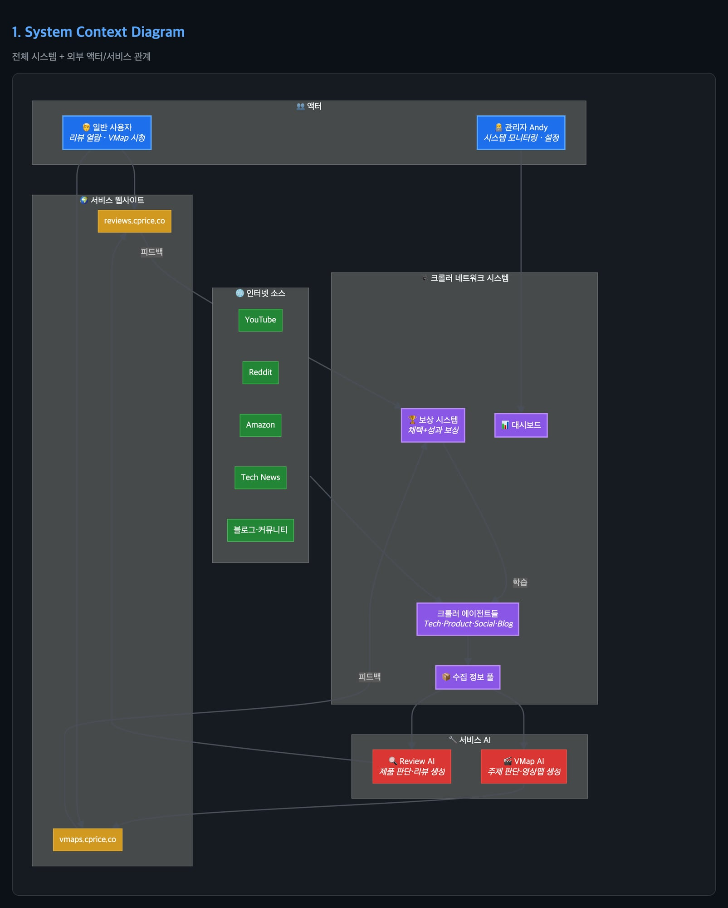
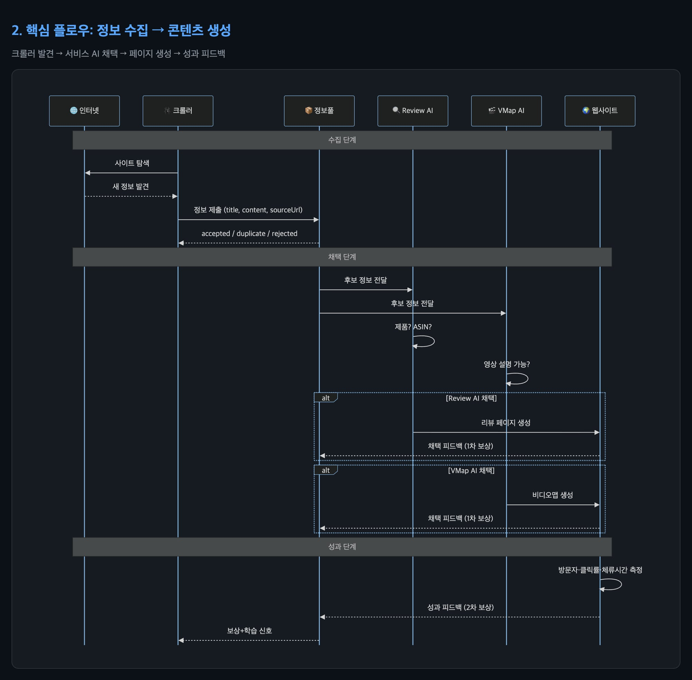
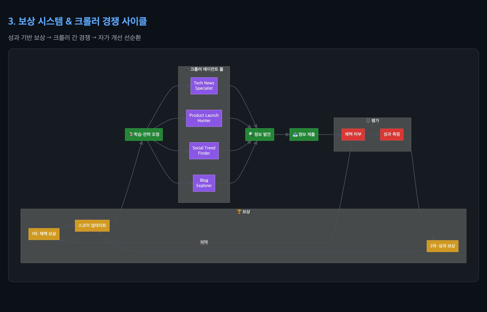
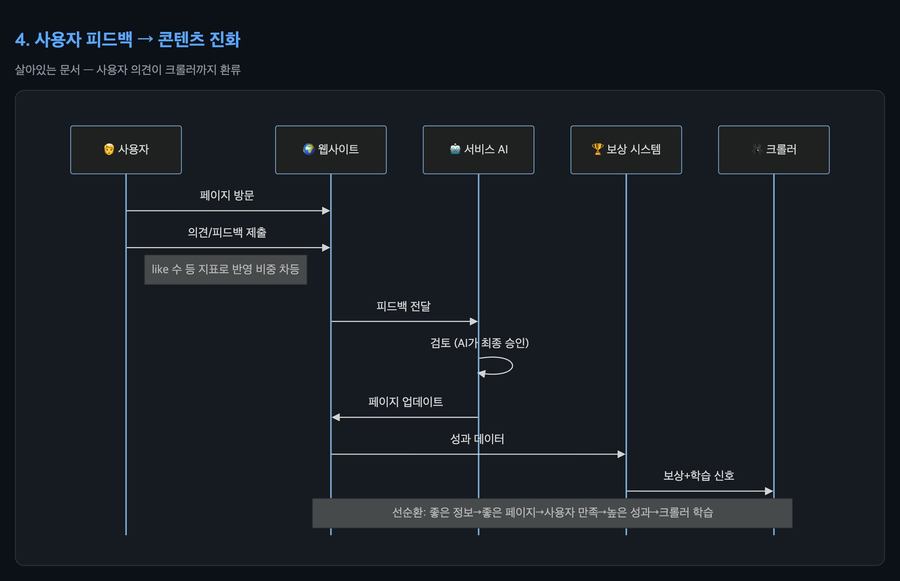
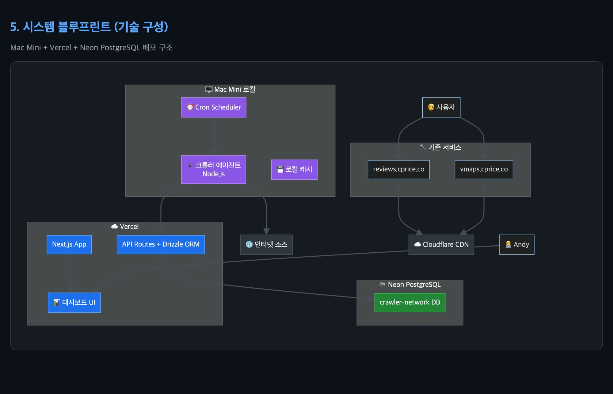

# 🕷️ 크롤러 네트워크 시스템 — Architecture

> CPrice Review + VMAP 통합 크롤러 인프라 · 성과 기반 보상 시스템

---

## 1. System Context Diagram

전체 시스템과 외부 액터(사용자/관리자), 인터넷 소스, 서비스 AI, 웹사이트 간의 관계.

**핵심 포인트:**
- 🕷️ 크롤러 네트워크는 서비스와 **독립 운영** — 범용 정보 수집
- 서비스 AI(Review AI / VMap AI)가 독립적으로 채택 판단
- 보상 시스템이 크롤러에 학습 신호를 환류
- 관리자는 대시보드로 모니터링

---

## 2. 핵심 플로우: 정보 수집 → 콘텐츠 생성

크롤러가 정보를 발견하고, 서비스 AI가 채택하여 페이지를 만드는 전체 시퀀스.

**3단계 흐름:**
1. **수집** — 크롤러가 인터넷 소스를 주기적으로 탐색, 정보 풀에 제출
2. **채택** — Review AI(제품/ASIN 판단), VMap AI(영상 설명 가능성 판단)가 독립 채택
3. **성과** — 생성된 페이지의 방문자수·클릭률·체류시간 → 2차 보상으로 환류

---

## 3. 보상 시스템 & 크롤러 경쟁 사이클

성과 기반 보상 → 크롤러 간 경쟁 → 자가 개선 선순환 구조.

**2단계 보상:**
- **1차 (채택 보상)** — 크롤러가 발견한 정보가 서비스 AI에 의해 채택되면 보상
- **2차 (성과 보상)** — 생성된 페이지의 실제 성과(방문·클릭·체류)에 따라 추가 보상

**크롤러 다양성:**
- Tech News Specialist / Product Launch Hunter / Social Trend Finder / Blog Explorer
- 각자 다른 소스·카테고리·키워드를 탐색하며 경쟁

---

## 4. 사용자 피드백 → 콘텐츠 진화

"살아있는 문서" — 사용자 의견이 페이지를 개선하고, 그 성과가 크롤러까지 환류.

**핵심 원칙:**
- 사용자 의견은 like 수 등 지표로 **반영 비중 차등** 적용
- AI가 피드백 검토 후 **최종 승인권** 보유
- 좋은 정보 → 좋은 페이지 → 사용자 만족 → 높은 성과 → 크롤러 학습 (선순환)

---

## 5. 시스템 블루프린트 (기술 구성)

현재 기술 스택 기반 배포 구조.

| 컴포넌트 | 기술 | 위치 |
|----------|------|------|
| 크롤러 에이전트 | Node.js 프로세스 | Mac Mini (로컬) |
| Cron Scheduler | Node.js | Mac Mini (로컬) |
| 웹 앱 + API | Next.js + Drizzle ORM | Vercel |
| 대시보드 | Next.js UI | Vercel |
| 크롤러 DB | PostgreSQL | Neon (별도 프로젝트) |
| CDN | Cloudflare | 클라우드 |
| 캐시 | 로컬 메모리 → Upstash Redis (추후) | Mac Mini → 클라우드 |

---

## 관련 문서

- [설계 문서 (DESIGN.md)](../DESIGN.md) — 전체 시스템 설계 상세
- [연동 가이드 (INTEGRATION_GUIDE.md)](../INTEGRATION_GUIDE.md) — 서비스 개발자용

---

*🕷️ Crawler Network System — Cpriceco, Inc. — Patent Pending*
